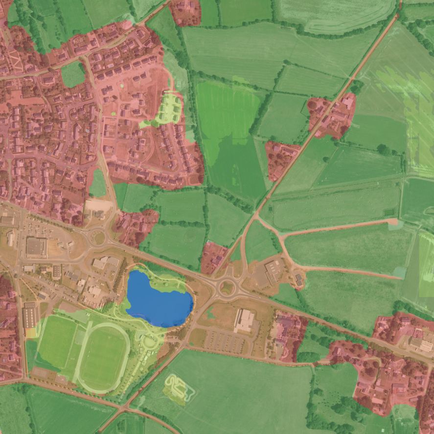
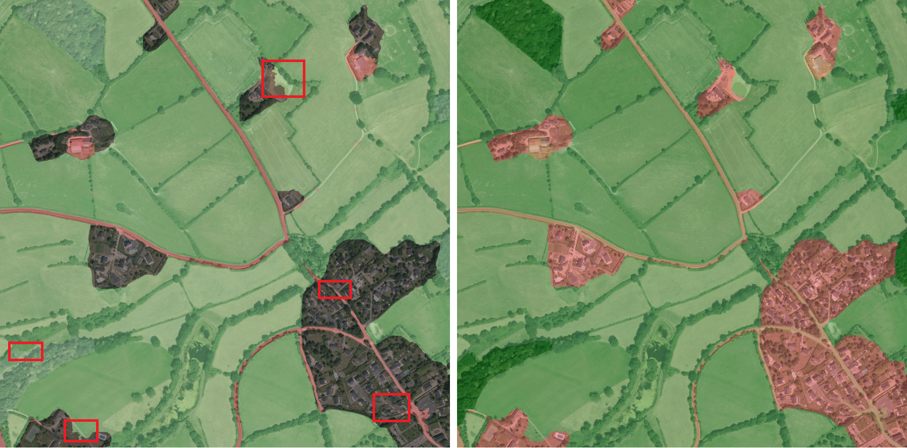

# 超清遥感图像语义分割

之前接到了一个任务，是分割出城市中的垃圾堆场，遂寻找到了 [UrbanAtlas 2012 database](https://ieee-dataport.org/competitions/data-fusion-contest-2022-dfc2022) 这个数据集和对应的 [baseline](https://github.com/isaaccorley/dfc2022-baseline)。

<p align="center">
    
</p>

## baseline

```log
IoU for class 1: 0.5667
IoU for class 2: 0.3504
IoU for class 3: 0.0001
IoU for class 4: 0.0002
IoU for class 5: 0.4121
IoU for class 6: 0.0204
IoU for class 7: 0.2439
IoU for class 8: 0.0000
IoU for class 9: 0.0000
IoU for class 10: 0.5839
IoU for class 11: 0.1610
IoU for class 12: 0.0241
IoU for class 13: 0.0161
IoU for class 14: 0.1747
Average IoU: 0.1824
```

## 基于 baseline 的改动

阅读了 baseline 的全部源码，发现了一些漏洞吧：

- 图像大小是 2000X2000 的，baseline 只随机选取其中的 512X512 进行训练，遂切割数据重新制作数据集
- 仔细观察每个类别，发现相同类别颜色差异比较大，遂增加颜色方面的数据增强
- dice loss 和 focal loss 在实践中的效果很差，替换为交叉熵损失函数。或者说，网上的论文笔记显示这两个损失很好，但我去 github 看实际开源的语义分割项目，几乎没人用他们
- 代码基于模型的层数很浅，特征提取能力差，暂时不更换大模型
- 训练时的图像大小是 512X512，预测时图像大小是 2000X2000，这不合理，遂滑动窗口预测，设置 0.2 的 overlap

由于代码封装的很好，修改 baseline 没有很费力。

```log
IoU for class 1: 0.6214
IoU for class 2: 0.4405
IoU for class 3: 0.1527
IoU for class 4: 0.1884
IoU for class 5: 0.1986
IoU for class 6: 0.0585
IoU for class 7: 0.4351
IoU for class 8: nan
IoU for class 9: nan
IoU for class 10: 0.6293
IoU for class 11: 0.2490
IoU for class 12: 0.0543
IoU for class 13: 0.0292
IoU for class 14: 0.4037
Average IoU: 0.2884
```

## 修正类别不平衡问题

说实话，我基于 baseline 尝试了很久都没有得到理想的结果，类别预测结果始终不平衡。我怀疑是模型太浅导致的，遂启动大模型尝试一番，选择的模型是 convnext-B。

```log
+---------------+-------+-------+
|     Class     |  IoU  |  Acc  |
+---------------+-------+-------+
|       No      | 68.48 | 88.35 |
|     Urban     | 52.54 | 62.05 |
|   Industrial  | 17.59 | 38.12 |
|  Construction | 41.65 | 59.32 |
| VegetableArea | 19.96 | 22.75 |
|   ArableLand  | 51.82 | 77.24 |
|   Permanent   | 69.12 | 85.83 |
|    Pastures   |  nan  |  nan  |
|    Complex    |  nan  |  nan  |
|    Orchards   | 77.51 | 94.05 |
|    Forests    | 51.93 | 68.07 |
|   Herbaceous  | 62.53 | 62.64 |
|  NoVegetables | 63.54 | 88.55 |
|   Waterlands  | 70.78 | 77.59 |
|     Water     |  nan  |  nan  |
|     Clouds    |  nan  |  nan  |
+---------------+-------+-------+
2022-03-07 11:12:47,396 - mmseg - INFO - Summary:
2022-03-07 11:12:47,396 - mmseg - INFO - 
+-------+-------+-------+
|  aAcc |  mIoU |  mAcc |
+-------+-------+-------+
| 77.11 | 53.95 | 68.71 |
```

## 难例挖掘

因为我发现类别交界处存在着标注不准确的问题，且推理结果也显示边界处容易出错，遂将边界处视为难例进行额外惩罚，惩罚措施很简单，将损失乘以 1.1。

<p align="center">
    
</p>


```log
+---------------+-------+-------+
|     Class     |  IoU  |  Acc  |
+---------------+-------+-------+
|     Urban     | 68.79 | 85.83 |
|   Industrial  | 54.58 | 65.91 |
|  Construction | 23.06 | 38.21 |
| VegetableArea | 41.28 | 52.51 |
|   ArableLand  | 17.68 | 19.36 |
|   Permanent   | 58.08 | 77.77 |
|    Pastures   | 69.99 | 88.18 |
|    Complex    |  nan  |  nan  |
|    Orchards   |  nan  |  nan  |
|    Forests    | 77.41 | 94.18 |
|   Herbaceous  | 54.07 | 66.39 |
|  NoVegetables | 84.76 | 86.15 |
|   Waterlands  | 69.48 | 92.11 |
|     Water     | 71.29 | 80.24 |
|     Clouds    |  nan  |  nan  |
+---------------+-------+-------+
2022-03-10 09:53:18,979 - mmseg - INFO - Summary:
2022-03-10 09:53:18,979 - mmseg - INFO - 
+-------+-------+-------+
|  aAcc |  mIoU |  mAcc |
+-------+-------+-------+
| 78.27 | 57.54 | 70.57 |
+-------+-------+-------+
```

# 致谢

本仓库中的工作得到西安电子科技大学高性能计算校级公共平台的支持. Supported by High-performance Computing Platform of XiDian University.
